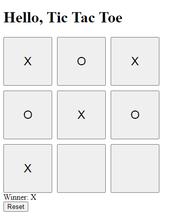

<span id="readme-top"></span>

<div align="center">

<h3 align="center">Angular 17 TicTacToe Game</h3>

  <p align="center">
    This is an Angular 17 standalone project implementing Jasmin, Karma and Cypres for testing. <br>
    Tic Tac Toe is a puzzle game for two players, called "X" and "O", who take turns marking the spaces in a 3×3 grid.
    <br />    <br />
    </p>
</div>

## Getting Started

### Prerequisites

- Angular 17
- Node >=20
- NPM >=10

### Installation

Clone this repository to your local machine:

1. Clone the repo

   ```sh
   git clone https://github.com/ricelq/pr_tictactoe_a17.git
   ```

2. Install dependencies via npm
   <br>(Download [node](https://nodejs.org/en) or [nvm](https://github.com/nvm-sh/nvm?tab=readme-ov-file) if not yet installed)

   ```sh
   npm install
   ```

3. Run application

   ```sh
   npm run start
   ```

4. Run e2e cypress test

   ```sh
   npm run e2e
   ```

## Enabled Packages

| Concern | Bundles                                            |
| ------- | -------------------------------------------------- |
| cypress | [`cypress`](https://www.npmjs.com/package/cypress) |

## Screenshots



## Contact

Ricel Quispe - [@linkedin](https://www.linkedin.com/in/ricelquispe) - ricel@prodeimat.ch

Project Link: [https://github.com/ricelq/pr_tictactoe_a17](https://github.com/ricelq/pr_tictactoe_a17)

<p align="right">(<a href="#readme-top">back to top</a>)</p>
